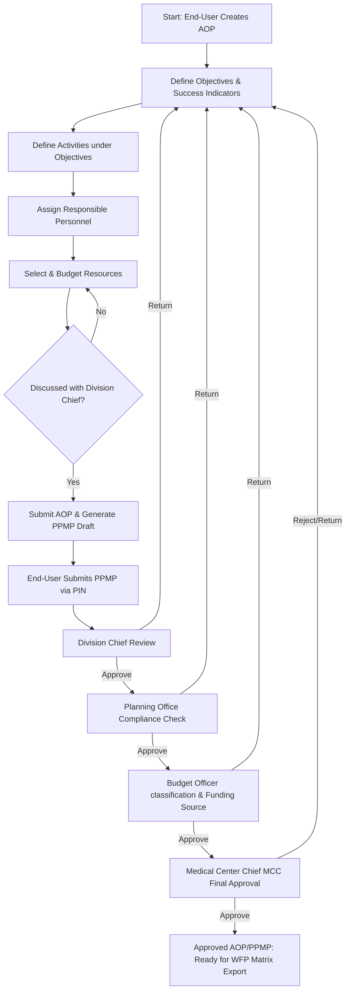

# ZCMC Enterprise Resource Planning (ERP) System

## AOP & PPMP Creation, Management, and Approval Modules

This document provides a comprehensive overview of the **Zamboanga City Medical Center (ZCMC)** Enterprise Resource Planning (ERP) frontend application. Specifically, it details the architecture, workflows, user roles, permissions, and codebase structure of the **Annual Operational Plan (AOP)** and **Project Procurement Management Plan (PPMP)** modules.

---

## 1. Project Context & Objectives

The ZCMC ERP is a web application designed to digitalize and streamline the medical center's planning and procurement cycles. It ensures that all department-level operational activities align with hospital missions and are backed by proper budget allocation and procurement scheduling in compliance with government auditing rules.

The system is centered around two core entities:
*   **Annual Operational Plan (AOP):** Formulates departmental goals, objectives, concrete activities, success indicators, and lists resources (personnel, equipment, and items) required to achieve them.
*   **Project Procurement Management Plan (PPMP):** Automatically compiles the items marked as "procurable" in the approved AOP, allowing departments to set monthly purchase schedules, estimate budgets, and request custom inventory items.

---

## 2. Core Workflows

The lifecycle of AOP and PPMP involves multiple stakeholders and moves through progressive stages:

### Phase 1: AOP Formulation (Draft State)
1. **Creation:** A department supervisor creates a new AOP for a given Fiscal Year.
2. **Objectives & Indicators:** The user defines the department's functions, objectives, and success indicators.
3. **Activities:** Concrete activities are created under each objective.
4. **Personnel Assignment:** Specific personnel, job designations, or areas are assigned to each activity to establish accountability.
5. **Resource Management:** Users search the central library to select resources (equipment, materials, services) required to execute each activity.

### Phase 2: AOP Submission
* **Alignment Pre-requisite:** Before submission, the end-user must confirm they have discussed this plan with their Division Chief via a validation prompt.
* **Excel Preview:** Users can download an `.xls` preview to double-check their planning entries.
* **Submission:** Once submitted, the AOP is locked for modification, and a draft PPMP is auto-generated containing all the procurable resource items listed in the AOP.

### Phase 3: PPMP Scheduling & Refinement
* **Regular vs. Dispensing PPMP:**
  * **Regular PPMP:** Standard departmental procurement containing the items requested under the department's own activities.
  * **Dispensing PPMP:** Tracks common-use medical/supplies requests redirected to the pharmacy or relevant dispensing units.
* **Item Schedules:** The user budgets the items across months (procurement timeline) and formats custom specs.
* **Custom Item Requests:** If a required item is not in the library, users submit a "New Item Request" containing specifications and market research. This goes to the Consolidators for library validation.
* **PIN Authentication:** Submitting the PPMP requires confirming with the user's secure 6-digit authorization PIN.

### Phase 4: Multi-Stage Approval
1. **Division Chief:** Reviews the submitted plan to ensure divisional alignment.
2. **Planning Office:** Conducts compliance checks and checks objectives mapping.
3. **Budget Officer:** Categorizes items (Procurable vs. Non-procurable), allocates the source of funds (e.g., MOOE or CO), and enters budgeting metrics.
4. **Medical Center Chief (MCC):** Grants final approval to the combined AOP and PPMP package.
5. **Output:** Once approved, the Work and Financial Plan (WFP) encoding matrix becomes directly downloadable as a spreadsheet.

---

## 3. Role-Based Access Control (RBAC)

The application enforces a strict role and permission matrix tied to the central **UMIS Single Sign-On (SSO)**.

| Role | Typical Key Permissions | Primary Module Access | Key Activities |
| :--- | :--- | :--- | :--- |
| **End-User / Supervisor** | `ERP-AOP-MAN:write` `ERP-PPMP-MAN:write` | Supervisor Portal (`/supervisor/aop`, `/supervisor/ppmp`, `/supervisor/new-item-requests`) | Create & edit AOP/PPMP, specify objectives, request custom items, submit via PIN. |
| **Division Chief** | `ERP-AOP-MAN:approve` `ERP-PPMP-MAN:approve` | Approval Portal (`/planning-ops/approval`) | Review department drafts, add comments, approve/return plans. |
| **Planning Officer** | `ERP-OBJ-MAN:write` `ERP-AOP-MAN:approve` | Planning Ops Portal (`/planning-ops/manage-objectives`) | Manage global objectives, perform preliminary compliance reviews. |
| **Budget Officer** | `ERP-PPMP-MAN:approve` | Planning Ops Portal & View PPMP | Review item list, classify procurability, allocate funds source (MOOE/CO). |
| **Medical Center Chief (MCC)** | `ERP-AOP-MAN:approve` `ERP-PPMP-MAN:approve` | Approval Portal | Final sign-off on all operational budgets and procurement plans. |
| **Consolidator / Librarian** | `ERP-ITM-MAN:write` `ERP-ITM-MAN:approve` | Item Management (`/consolidator/item-library`, `/consolidator/item-requests`) | Manage global items database, categories, classifications, approve custom item requests. |

---

## 4. Technical Architecture & Tech Stack

The front-end client is built using modern React guidelines and premium UI elements:

*   **Build Tool & Runner:** [Vite 6](file:///c:/Users/abarretto/Documents/GitHub/zcmc-erp-front/vite.config.js) using ES modules.
*   **Core Library:** React 19.
*   **UI Components:** `@mui/joy` (Joy UI) for visual aesthetics, backed by select `@mui/material` controls and `lucide-react`/`react-icons` for micro-icons.
*   **Styling System:** Vanilla CSS, styled-components, and a custom theme configuration mapping core ZCMC colors (e.g., `#003049` and `#004366` dark blues) with Poppins typography ([App.jsx](file:///c:/Users/abarretto/Documents/GitHub/zcmc-erp-front/src/App.jsx)).
*   **State Management:** [Zustand](file:///c:/Users/abarretto/Documents/GitHub/zcmc-erp-front/src/Store/) (using middleware like `persist` for keeping state in LocalStorage).
*   **Routing:** React Router DOM (v6) with permission guards ([PageRoutes.jsx](file:///c:/Users/abarretto/Documents/GitHub/zcmc-erp-front/src/Routes/PageRoutes.jsx)).
*   **Networking:** Axios client mapping REST endpoints with standard success/failure callback hooks.
*   **Real-time Updates:** Socket.io client for real-time notification streams.
*   **Animations:** Framer Motion for smooth modal transitions and page switches.

---

## 5. Codebase Directory Structure

The repository is structured to separate pages, stores, hooks, services, and components cleanly:

*   **`src/Pages/`** Contains all primary page components:
    *   `AOP/EndUser/` - Dashboards, resource tables, objectives, and timeline views for formulating AOPs.
    *   `AOP/Approval/` - Decision-making interfaces for Division Chiefs, Planning, and MCC.
    *   `PPMP/EndUser/` - Views for adjusting monthly item quantities, budgeting, and submitting.
    *   `PPMP/Approval/` - Interfaces like `ViewPPMP.jsx` where budget officers configure fund allocation.
    *   `Consolidators/` - Library manager and item consolidation pages.
    *   `PlanningOps/` - Management pages for global objectives and dispensing units.
*   **`src/Store/`** Global Zustand stores for state propagation:
    *   `AOPStore.jsx` - AOP data, mission, and current fiscal year.
    *   `ObjectivesStore.jsx` - Section functions, objectives, and success indicators.
    *   `AuthStore.jsx` - Auth user details, permissions, and active session tags.
    *   `ActivitiesStore.jsx` - Activity arrays and detail templates.
*   **`src/Hooks/`** Custom React hooks encapsulating business logic:
    *   `AOP/` & `PPMP/` - Actions for creating, viewing, updating, and exporting.
    *   `ItemRequest/` - Handling user item requests.
    *   `CommentHook.jsx` - Managing approval trails, reviews, and corrections feedback.
*   **`src/Components/`** Shared UI elements (e.g., custom loaders, authorization PIN inputs, common modals, and search components).
*   **`src/Routes/`** Routing setup:
    *   `PageRoutes.jsx` - Comprehensive list of sidebar routes, hierarchy, and explicit permission lists.
    *   `ProtectedRoutes.jsx` - Validates UMIS SSO sessions and controls initial landing redirects.
*   **`src/Services/`** Endpoint client mappings:
    *   `Config.jsx` & `ERP_API.jsx` - Base API endpoints and socket URLs.
    *   `RequestMethods.jsx` - General axios request handlers (CRUD wrappers).
